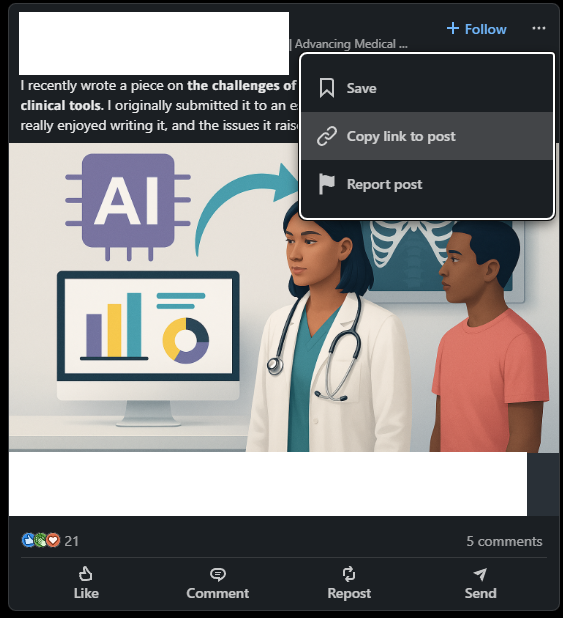
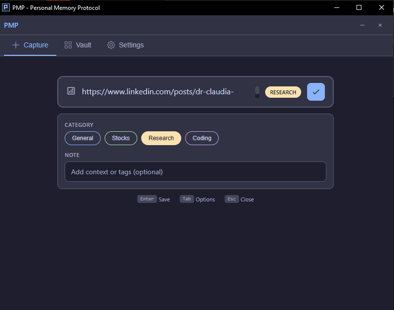
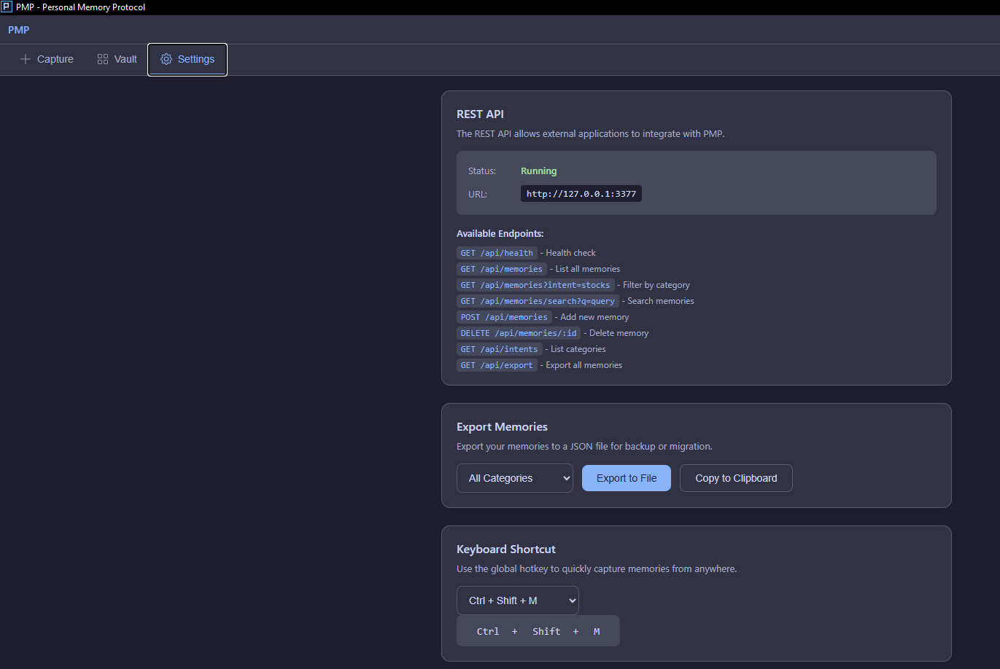
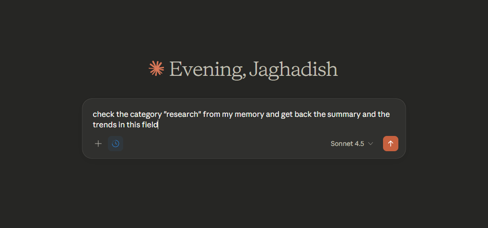
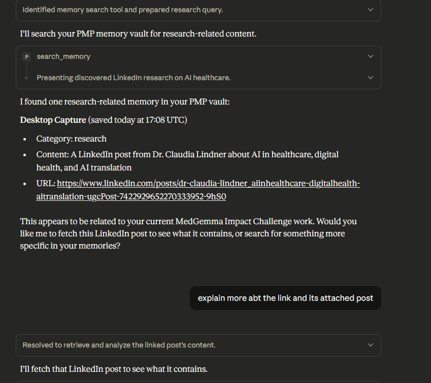

# PMP - Personal Memory Protocol

A local-first personal memory system that helps you capture, organize, and recall information instantly.

## Download

Download the latest version from the [Releases](https://github.com/Jaghadish/pmp/releases) page.

### Windows
- **PMP_1.0.0_x64-setup.exe** - Installer (recommended)
- **PMP_1.0.0_x64_en-US.msi** - MSI installer
- **pmp-daemon.exe** - Standalone MCP daemon for Claude Desktop

## Features

- **Instant Capture** - Global hotkey (Ctrl+Shift+M) saves anything in under a second
- **Smart Categories** - Organize memories into stocks, coding, research, or custom categories
- **100% Local** - Your data stays on your device. No cloud. No tracking.
- **Claude Desktop Integration** - Works as an MCP server so Claude can access your memories
- **REST API** - Build your own integrations

## How It Works

### Step 1: Copy any link (PDF, website, article, etc.)



### Step 2: Press the hotkey (Ctrl+Shift+M) to capture

The PMP window appears. Select a category and save.



### Step 3: Access settings, export data, or configure the API



### Step 4: Ask Claude to search your memories



### Step 5: Claude retrieves your saved content



## Claude Desktop Integration

Add to your Claude Desktop config (`%APPDATA%\Claude\claude_desktop_config.json`):

```json
{
  "mcpServers": {
    "pmp": {
      "command": "C:/path/to/pmp-daemon.exe",
      "args": ["--mcp"]
    }
  }
}
```

Then ask Claude:
- "Search my memories for research"
- "What did I save about AI healthcare?"
- "Check my PMP vault for stocks"

## REST API

The app runs a local REST API on port 3377:

```bash
# List memories
curl http://127.0.0.1:3377/api/memories

# Search
curl "http://127.0.0.1:3377/api/memories/search?q=query"

# Add memory
curl -X POST http://127.0.0.1:3377/api/memories \
  -H "Content-Type: application/json" \
  -d '{"content": "Remember this", "intent": "general"}'
```

## Data Storage

All memories stored locally in `~/.pmp/vault/` as JSON-L files:
```
~/.pmp/
├── config.json
└── vault/
    ├── general.jsonl
    ├── stocks.jsonl
    ├── research.jsonl
    └── coding.jsonl
```

## License

Apache License 2.0

Copyright 2024 Jaghadish
